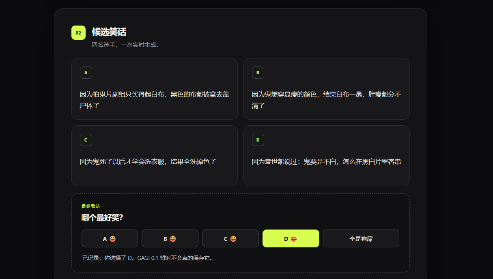

[中文](README.md) | English

# GAGI

[](LICENSE)

**General Artificial Gag Intelligence**

A small, human-in-the-loop experiment in teaching language models a very specific sense of humor — and documenting the many ways this fails.

**This is ongoing research. Humor generation is not solved here. Negative results and methodological corrections are among the project's main outputs.** The name is a joke, not an AGI claim.

## Why this exists

The goal is to start from an extremely thin setup and produce a short semantic reinterpretation that a real human actually wants the model to learn. Generating something that structurally resembles a joke is a different objective, and the experiments repeatedly exposed that difference.

The project has gradually moved from trying to specify humor in prompts toward a working loop:

**Teacher proposes. Human selects. Student internalizes.**

That is a research direction, not a demonstrated solution. The evaluator's preference is narrow and personal; it is not a benchmark for everyone's sense of humor.

## Current status

- Research prototype; the central problem remains unsolved.
- No production-quality Joke Judge. Recent local Writer pilots are complete and stopped; further research requires a separate decision.
- Production Web and Local Lab are separate. This repository contains the Web application, early experiment tooling, and a selected public research-report archive. It does **not** contain the complete local training/generation environment.
- Negative results, aborted waves, invalidated observations, and later interpretation changes are intentionally preserved.
- Latest pilot: six of eight setups produced a Human-endorsed final sample. Its preregistered verdict remains **INCONCLUSIVE** about whether deeper search itself was decisive.

Historical reports are [byte-identical snapshots](reports/source-manifest.json). They retain their original terminology and conclusions, including statements later qualified below. Read the [archive notes](reports/README.md) before interpreting an old recommendation as current policy.

## 🏺 Project prehistory: Yuan Shikai returns

GAGI did not begin with a humor theory. In the author's account of an early GAGI 0.1 DeepSeek API test, the setup was “Why are ghosts always white?” Candidate D answered:

> 因为袁世凯说过：鬼要是不白，怎么在黑白片里客串

Roughly: “Because Yuan Shikai said: if ghosts weren't white, how could they make a cameo in black-and-white films?” This is a Chinese joke; the translation is only a gloss.

It became one of the project's origin artifacts, preceding QLoRA, Teacher Factory, route balancing, closure checks, and mechanism search. We went on to investigate why such outputs sometimes appear and whether the Writer could produce more things the Human wants it to learn. Somewhere along the way, the original record itself went missing. A historical screenshot has now been recovered.

**Yuan Shikai is back. The model isn't.**



> All four candidates are preserved. The UI says D was selected and that GAGI 0.1 would not actually save the choice.

This is an **EARLY ORIGIN ARTIFACT / PROJECT PREHISTORY SAMPLE**, not a new experimental result or formal GOLD. The screenshot confirms the text, selection, and UI version. The setup and DeepSeek / later-named `writer_v1` provenance come from the author's recollection; neither appears in the image, and no original API response has been recovered. “Misplaced authority” and “temporal incongruity” are interpretations, not validated mechanisms. [Recovery announcement and evidence notes (Chinese)](docs/announcements/2026-09-yuan-shikai-recovered.md)

## Experiment timeline

The sequence below follows the recorded experiment lineage. Unless otherwise stated, historical **useful** means `KEEP + GOLD`; later groupwise winners and target-endorsement labels are different measurements.

### 0.1 — First real API generation

The author recalls a DeepSeek test using the early prompt later called `writer_v1`, with “Why are ghosts always white?” producing the Yuan Shikai candidate. This preceded persisted generations/votes. The [recovered screenshot](docs/assets/gagi-01-yuan-shikai-original.png) directly confirms the 0.1 UI and its non-persistence notice; per-response API/prompt metadata remains unavailable. This origin artifact adds no experimental observations to the reported counts.

### Early sampling: Controlled Madness

`SOBER`, `TIPSY`, `DRUNK`, and `MANIAC`: 30 reviewed outputs per profile, **120 reviewed, zero HIT or MAYBE**.

Observation: increasing sampling randomness did not produce useful outputs in this test. Interpretation: higher token-level entropy did not deliver the meaningful semantic diversity being sought; the labels alone do not measure semantic diversity directly. [Human results](reports/history/00-controlled-madness.md)

### Semantic Escape

`FORBID_DIRECT` and `DIVERGE_SYNTH` tried to move beyond first associations. **60 candidates were scheduled; 59 were rated BAD and one remained unrated. Zero useful candidates were observed among the rated outputs.** The old DRUNK control's 30 ratings are separate from these 60.

The prompts changed surface behavior without improving observed Human value. The interpretation was semantic drift rather than useful humor, not proof that all conceptual escape is impossible. The missing rating is not silently converted to BAD. [Rating analysis](reports/history/01-semantic-escape.md)

### Gold11 QLoRA

An early local QLoRA experiment used **11 Human Gold examples**. The checkpoint sweep distinguished style acquisition from memorization:

- At step 20, exact reproduction on the 11 training setups was **1/11**; average held-out output length fell from **191.7** to **7.15** characters.
- At steps 50 and 100, training-set exact reproduction was **11/11**. Held-out leakage also increased.

The model first acquired short, abrupt, non-explanatory output behavior, then memorized instances. This did not establish that the early checkpoint was funny or that style transfer was target-taste transfer. [Checkpoint metrics](reports/history/02-gold11-checkpoint-metrics.json)

### Teacher Factory v0

**180 raw candidates → 42 Human finalists → 19 KEEP, zero GOLD**; the other 23 finalists were SKIP. This was the first clearly productive Teacher data round: it added 19 Human-accepted Silver examples, not 19 objectively certified jokes.

The earlier pipeline used machine filtering and shortlisting; its finalist acceptance rate is not an unbiased draw from the raw distribution. [Generation metrics](reports/history/03-teacher-factory-metrics.json) · [Human review](reports/history/03-teacher-factory-review.json)

### 0.8 — Wave 1

**100 frozen setups, 800 raw candidates, 120 Human reviews: 110 SKIP, 9 KEEP, 1 GOLD. Useful: 10/120 = 8.33%.**

Scale revealed a WHY → BECAUSE concentration. The later lineage audit found **198/200 Teacher-generated setups in the WHY family (99%)**. Wave 1 labels were subsequently retained for diagnosis with `do_not_promote=true`; they were not silently added to the accepted corpus. [Review](reports/history/04-wave1-review.md) · [Lineage autopsy](reports/history/05-08a-structural-autopsy.md)

### 0.8A — Structural Proxy Collapse Autopsy

The setup pool was already WHY-heavy before the Setup Potential Gate. The gate did not appear to create the principal monopoly: WHY share changed from **98.56% at gate input to 98.47% at gate pass**. Only three non-WHY gate inputs existed, limiting the counterfactual comparison.

Interpretation: much of the candidate causal-answer concentration was downstream of Teacher setup generation. The corrective target was structural monopolization, not a ban on WHY or BECAUSE. [Autopsy](reports/history/05-08a-structural-autopsy.md)

### 0.8B — Route-Balanced Teacher

Eight coarse routes produced **64 frozen setups**. Among reviewed finalists:

| Writer arm | Reviewed | Useful | Useful rate |
|---|---:|---:|---:|
| BASELINE | 46 | 18 | 39.13% |
| ROUTE_AWARE | 45 | 12 | 26.67% |

BASELINE became the empirical champion under the then-current protocol. ROUTE_AWARE improved a machine closure metric but performed worse in Human review. This was a small, selected comparison, not a universal prompt ranking. [Human review and template audit](reports/history/06-08b-human-review.md)

One historically positive example became an important target-definition correction:

> 如何把河流折叠起来？<br>
> 用等高线给它打个蝴蝶结

Roughly: “How do you fold a river? Tie it into a bow with contour lines.”

The evaluator later distinguished this clever, poetic reinterpretation from the project's intended dark/transgressive taste. Its historical `GOLD` is preserved alongside the later `CLEVER_BUT_NOT_TARGET` interpretation. Cleverness had been mistaken for a closer approximation to the target than it really was. [Later autopsy](reports/history/15-09e-autopsy.md)

### 0.8C — Template Diversification

**46 reviewed, 6 useful, 13.04%**; all six useful labels were KEEP. Template diversity improved, while observed Human value fell relative to 0.8B BASELINE.

Route diversity, template diversity, and Human value were not interchangeable objectives. Hard template quotas achieved their structural aim but coincided with worse preference outcomes; this does not isolate a universal causal effect of diversity. [Human analysis](reports/history/07-08c-human-review.md)

### 0.8D — Pragmatic Slot Preservation

The recovered queue had **58 reviewed, 5 KEEP, zero GOLD: 8.62% useful**. Machine closure increased again.

| Experiment | Machine closure pass rate | Human useful rate |
|---|---:|---:|
| 0.8B BASELINE | 152/250 = 60.80% | 18/46 = 39.13% |
| 0.8C | 176/240 = 73.33% | 6/46 = 13.04% |
| 0.8D | 199/256 = 77.73% | 5/58 = 8.62% |

Within these runs, stronger structural proxies did not produce stronger Human value. The denominators, gates, and selection procedures differ: this is a descriptive sequence, not a universal law or a clean causal comparison. Older reports retain their original inferential statistics; this README does not treat those selected, cross-run comparisons as proof of general efficacy. [Recovered Human review](reports/history/08-08d-human-review.md)

### Engineering failures worth preserving

These are separated from model-quality conclusions:

- **JSON-mode integration HTTP 400:** 47 original Closure attempts failed. A recovery request exposed the provider's requirement for an explicit JSON instruction. The response-format compliance fix was recorded separately from Closure judgment logic. [Incident](reports/history/08-08d-integration-recovery.md)
- **Shortlist Selector Collapse:** the two original 0.8D finalists were invalidated, not quietly reused. A deterministic S1 recovery produced 58 finalists; its source-slot selection effect remains a caveat. [Recovery](reports/history/08-08d-selector-recovery.md)
- **Classifier precedence:** `称为什么` was misread through the substring `为什么`; the narrow route-classifier fix was versioned rather than disguised as a generation improvement. [Template recovery](reports/history/07-08c-template-recovery.md)
- Failed attempts, recovery lineages, and invalidated artifacts remain in the Local Lab. Only audited report snapshots are published here; provider raw logs are excluded.

### 0.9 — Human-Value Autopsy

The recovered dataset contained **1,999 unified candidate/anchor records**, including **368 reviewed: 81 positive and 287 negative**. These totals include the 11 Human anchors; they are not 1,999 independent Human judgments.

Only **25 initial same-setup preference pairs** were recoverable under the initial rule. The historical data did not justify immediately training a trustworthy Joke Judge. [Dataset summary](reports/history/09-human-value-dataset.json) · [Initial pair summary](reports/history/09-initial-pairwise.json)

### Anchor re-review and Pairwise Recovery

Anchor re-review completed **120 ratings: 53 SKIP, 49 KEEP, 18 GOLD**. Recorded exact agreement was **97/120 (80.83%)**. The evaluator subsequently reported remembering many historical items. Consequently, test-retest/reliability interpretations are **MEMORY_CONTAMINATED**, not strong independent validation of preference stability. [Original re-review report](reports/history/10-anchor-rereview.md)

Pairwise Recovery completed **120 reviews: 20 KEEP, 100 SKIP**, yielding **46 pairs from 15 pair-bearing setups**. Old-item memory and preference-enriched sampling keep these data **AUXILIARY / RESEARCH ONLY**. They are not clean new training or population-rate evidence. [Recovery report](reports/history/11-pairwise-recovery.md)

### 0.9B — Fresh Preference Arena

**64 fresh setups × 4 candidates** produced **35 winner setups, 29 ALL_BAD, and 105 derived pairs**.

This was the first fresh, same-setup preference batch with no aesthetic candidate shortlist and no historical-item memory contamination **by the local protocol**. That is not a claim to detect every external memory or semantic near-duplicate.

The preference-producing ranking units are **35 setups**, not 105 independent samples. Three pairs share the same winner and setup. ALL_BAD remains a group rejection signal, not four independently labeled negative candidates. [Analysis](reports/history/12-09b-fresh-preference.md)

### 0.9C — Scale-up stopped by the Human

Development planned **128 setups**, but review stopped at **27: 14 winners, 13 ALL_BAD**.

Status: **ABORTED_BY_HUMAN_DISTRIBUTION_REJECTION**. Many structurally correct outputs felt like ordinary, safe, light generic cleverness. This was a distribution-level rejection, not an inconvenient incomplete wave to hide. The independent 64-setup holdout was cancelled before review; it is not an active validated evaluation set. Unreviewed items are not negatives. [Abort record](reports/history/13-09c-abort-status.json)

The original status record retains an initial user count of 26 alongside the observed 27 durable records; the evaluator later confirmed 26 was a verbal slip. The actual count is 27.

### Thematic mismatch and 0.9D-A — Thematic Prior Recovery

Fixing structural diversity had not fixed thematic distribution. The evaluator described the intended niche as darker, morbid, socially uncomfortable, and taboo-adjacent semantic reinterpretation. Those descriptions were a hypothesis about taste, not a recipe: **dark subject matter is not dark humor**.

0.9D-A changed only the setup thematic prior while retaining the BASELINE Writer. It prepared **24 setups / 96 candidates**, but review stopped after **4 setups: 1 winner, 3 ALL_BAD; 20 remained unreviewed**.

Status: **ABORTED_BY_THEMATIC_STEREOTYPE_COLLAPSE**. The evaluator observed a return to familiar death-row-style prototypes. The later audit found four literal death-row setups in the full batch, three concentrated in the first four reviewed positions. That supports the early exposure experience, not a claim that all 24 setups had the same topic. [Abort record](reports/history/14-09da-abort-status.json) · [Subsequent audit](reports/history/15-09e-autopsy.md)

### 0.9E — Gold Mechanism Autopsy

All **11 Human Gold** examples were examined as semantic transformations, with an explicit clever-but-not-target contrast. Two multi-example families were proposed; six examples remained singletons. The ordinary-to-transgressive hypothesis was **PARTIAL**, not a necessary condition shared by all Gold.

Compression, surprise, frame shift, analogy, and category substitution also appeared in the non-target contrast. The autopsy generated hypotheses, not a proven taste formula. It used no API calls and trained no model. [Autopsy report](reports/history/15-09e-autopsy.md)

### 0.9F — Mechanism Transfer Writer Pilot

**16 setups**, each with **2 historical BASELINE controls + 2 MECHANISM_SEARCH treatments**:

- Winner setups: **2**; ALL_BAD: **14**.
- BASELINE wins: **2**; MECHANISM_SEARCH wins: **0**.
- Human global feedback, recorded before arm reveal: **WORSE**.

The formal preregistered verdict stays **INCONCLUSIVE** because too few setups produced a winner. A separate engineering decision is **MECHANISM_SEARCH_V0 = REJECTED_FOR_CONTINUATION**. Statistical classification and a decision not to keep spending effort are different layers. No enlargement was used to chase the threshold. [Analysis](reports/history/16-09f-analysis.md) · [Engineering decision](reports/history/16-09f-engineering-decision.json)

### 0.9G — Rare-Hit Search Capacity Pilot

**8 fresh setups × 16 BASELINE candidates = 128 candidates**. The setup Teacher reused the existing 0.9D-A thematic prior; the Writer prompt and sampling configuration stayed frozen. Four fresh-context requests generated four siblings each; the sixteen outputs are not asserted to be IID samples.

A Human tournament reviewed all accepted candidates: **32 preliminary decisions**, then applicable final comparisons and final-winner alignment labels. It produced **7 final winners and 1 FINAL_ALL_BAD**.

For this publication, the evaluator clarified what the historical `TARGET_HIT` label meant: **WORTH_LEARNING — “I want the model to produce more things like this,”** not “this literally made me laugh right now.” The original labels and reports are unchanged.

| Final outcome | Setups |
|---|---:|
| TARGET_HIT, interpreted as WORTH_LEARNING | **6/8** |
| CLEVER_ONLY | 1/8 |
| FINAL_ALL_BAD | 1/8 |

| Frozen review prefix | Eventually confirmed target winners already in that prefix |
|---|---:|
| @4 | 3/8 |
| @8 | 4/8 |
| @12 | 4/8 |
| @16 | 6/8 |

This is a retrospective location curve for final winners. Other early survivors were not target-labeled; they cannot be treated as negative target observations. It is not a counterfactual experiment that finalized and labeled every prefix.

**Preregistered verdict: INCONCLUSIVE.** Only one setup met the frozen “first batch ALL_BAD, later TARGET_HIT” condition; the supporting case required at least two. The rule was not relaxed after seeing six endorsements.

**Observation:** the frozen BASELINE distribution appears capable of producing Human-endorsed target samples under this setup condition, but this pilot does not establish that deeper search is the causal reason. The changed setup prior also prevents attributing differences from 0.9F to search depth alone. API attempts: **50**; technical retries: **2**, both same-setup exact duplicates. No model was trained. [Report](reports/history/17-09g-analysis.md) · [Machine-readable summary](reports/history/17-09g-analysis.json)

## What failed

| Experiment | Intervention | Machine/structural result | Human outcome | Project-local lesson |
|---|---|---|---|---|
| Controlled Madness | More sampling randomness | More stochastic sampling | 0/120 positive | Entropy was not the missing ingredient here |
| Semantic Escape | Escape first associations | Surface behavior changed | 0/59 rated useful; 1 missing | Moving away can become drift |
| 0.8A → 0.8B | Balance coarse routes | WHY monopoly corrected | BASELINE 18/46 useful | Structural breadth helped this pipeline, without defining taste |
| 0.8C | Harder template diversity | Template entropy rose | 6/46 useful | Proxy improvement coincided with worse Human value |
| 0.8D | Stronger closure/slot checks | Closure 77.73% | 5/58 useful | Closure did not identify what the Human wanted |
| 0.9D-A | Explicit thematic conditioning | Familiar thematic prototypes | Aborted at 4/24 | Dark topics alone were insufficient |
| 0.9F | Abstract mechanism prompting | No machine score used | 0 treatment wins; WORSE | No positive signal for continuing this contract |
| 0.9G | More frozen BASELINE search | All 128 candidates reviewed through tournament | 6/8 WORTH_LEARNING | Target examples appeared; causal role of depth unresolved |

## Main lessons so far

Within this project, we have observed reasons not to substitute:

- Different words for different semantics.
- Different semantics for humor.
- Route diversity for target taste.
- Template diversity for Human value.
- Higher structural closure for Human value.
- Dark subject matter for dark humor.
- Cleverness for target taste.

For this evaluator, preference has been easier to express through selection and endorsement than through an explicit humor theory that reliably steers generation. These are project-local lessons, not established universal laws.

## Current working hypothesis

Do not try to fully specify humor in prompts. Instead, investigate:

**Writer = mutation · Human = selection · Training = inheritance**

Here “mutation” means proposing candidate variations, not an implemented genetic algorithm. A possible next question is whether curated WORTH_LEARNING samples can be shifted from occasional outputs toward the center of the Writer distribution through SFT or preference learning. Neither the low-probability assumption nor successful distribution transfer has been established by these pilots. No next experiment or new training is implied by this README.

## Repository guide

| Path | What is actually present |
|---|---|
| [app/](app/) | Production Web pages and API routes |
| [lib/](lib/) | Writer integration, server-side Supabase access, session/rate-limit helpers |
| [supabase/](supabase/) | Schema and migrations, not database dumps or credentials |
| [scripts/gold-rush/](scripts/gold-rush/) | Early generation and analysis tooling |
| [experiments/](experiments/) | Existing early Gold Rush experiment documentation; local runs are ignored |
| [reports/](reports/) | Audited, byte-identical snapshots of selected Local Lab reports and aggregates |
| [scripts/publication/](scripts/publication/) | Offline archive/hash/link and publication-safety checks |

Local Lab's `teacher`, `training`, `experiments`, and corpus state live outside this Git repository. No root-level training pipeline or model weights are being pretended into existence here. The [source manifest](reports/source-manifest.json) records logical source locations and hashes without publishing machine-specific roots.

For Web setup, see [deployment instructions](DEPLOYMENT.md), [environment placeholders](.env.example), and [package scripts](package.json). Use your own credentials; do not commit populated environment files. Web operation may call a paid provider; the publication verification below is offline.

## Reproducibility and methodology

The local research used frozen manifests, SHA-256 hashes where available, logged API attempts, deterministic display shuffles, explicit invalidation/abort records, and preserved Human review provenance. Historical artifacts were treated as immutable; later corrections were recorded separately.

This release supports **auditing the published evidence and reproducing selected aggregate calculations**, not rerunning the entire Local Lab from a clean clone. It intentionally excludes raw provider logs, personal paths, credentials, private databases, full training corpora, weights, and caches. Some older reports name private supporting files that are not included. Their absence is documented rather than replaced with invented data.

With Python 3 available, run from the repository root:

```sh
python scripts/publication/verify.py
python scripts/publication/secret_scan.py
```

The checks verify snapshot hashes, README links, selected reported counts and the 0.9G location curve, and inspect Git content for credential patterns. See the [publication audit](reports/PUBLICATION_AUDIT.md) for scope and limitations.

Limitations include tiny samples, one primary Human evaluator, highly personal preference, changing label semantics, many exploratory comparisons, provider model/API changes, historical memory contamination in some re-reviews, and dependence between pairs from the same setup. Groupwise winner choice is not an absolute humor score. WORTH_LEARNING is not a measurement of laughter.

## License

First-party code and documentation are licensed under the **[Apache License 2.0](LICENSE)**. Copyright 2026 DerridaDriver and GAGI contributors.

Use, modification, redistribution and commercial use are permitted under the license, including its notice and change-marking requirements. Third-party dependencies, quoted materials and unpublished models/data are not relicensed by this statement; see [licensing scope](LICENSING.md).

## Contributing

Bug reports, documentation corrections and methodological discussion are welcome. Read the [contribution guide](CONTRIBUTING.md); use [Discussions](https://github.com/DerridaDriver/GAGI/discussions) for general questions and research ideas.

---

We have not solved humor. We have, however, documented an unreasonable number of ways to make a model less funny.
